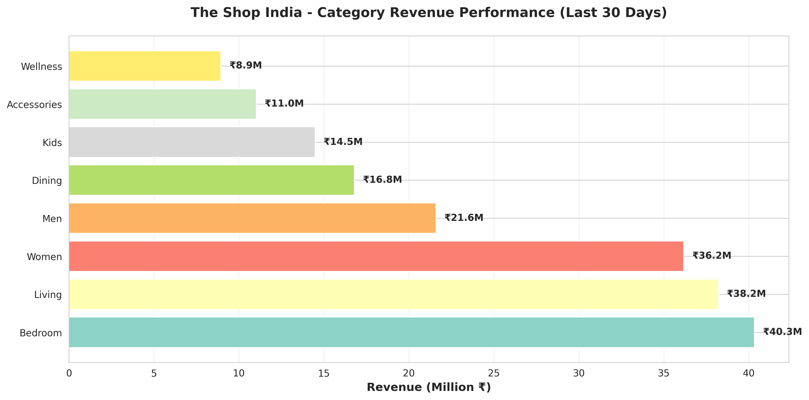
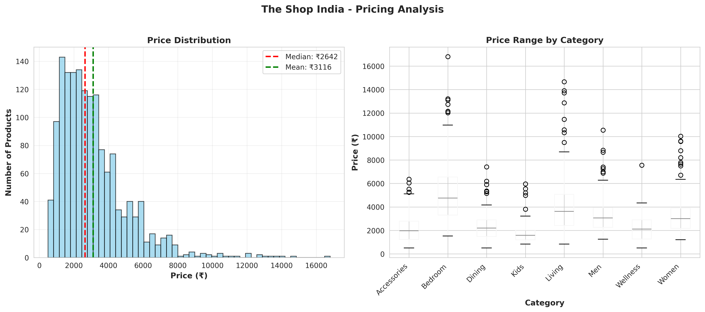
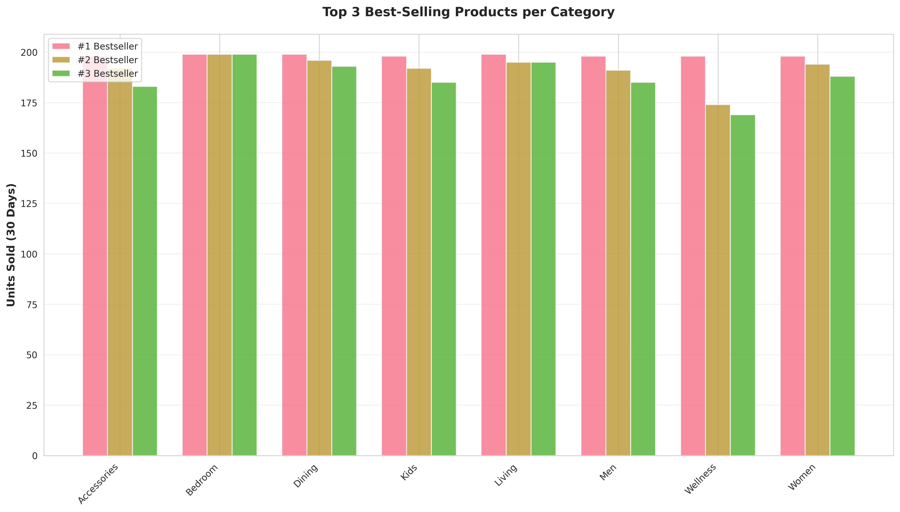
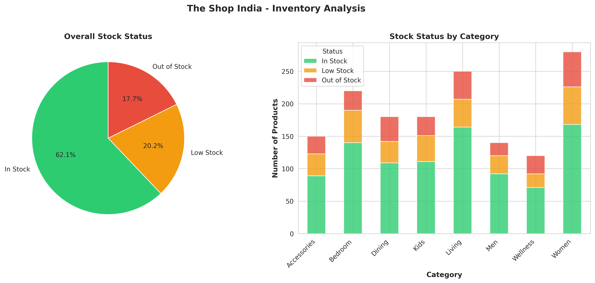

# THE SHOP INDIA - E-COMMERCE PRODUCT ANALYTICS

**Data Analysis Project for Interview**  
**Analyst:** Utkarsh Gaur  
**Date:** February 2026  
**Position:** Data Analyst - The Shop India

---

## 📊 PROJECT OVERVIEW

This project provides comprehensive data analytics for The Shop India's e-commerce product catalog, analyzing **1,520 products** across **8 main categories** to identify business opportunities and optimization strategies.

### Objectives:
1. Identify best-selling products by category
2. Analyze pricing strategies and revenue optimization
3. Evaluate inventory management and stock availability
4. Assess customer satisfaction across categories
5. Provide actionable business recommendations

---

## 🎯 KEY FINDINGS

### 💰 Revenue Analysis
- **Total Revenue (30 days):** ₹187.56 Million
- **Top Revenue Category:** Bedroom (₹40.3M - 21.5% of total)
- **Highest Growth Potential:** Wellness category (untapped premium segment)

### 🏆 Best Performers
| Category | Revenue (30d) | Units Sold | Avg Rating |
|----------|---------------|------------|------------|
| Bedroom | ₹40.3M | 8,397 | 4.21/5 |
| Living | ₹38.2M | 9,705 | 4.19/5 |
| Women | ₹36.2M | 11,251 | 4.24/5 |
| Men | ₹21.6M | 6,011 | 4.25/5 |

### 📦 Stock Insights
- **30 bestselling products** are currently out of stock
- **Est. Lost Revenue:** ₹2.5M+ per month
- **Immediate Action Required:** Restock high-demand items

### 💡 Customer Satisfaction
- **Overall Rating:** 4.21/5.0
- **Highest Rated:** Men's category (4.25/5.0)
- **Most Reviewed:** Women's category (focus of customer engagement)

---

## 📈 VISUALIZATIONS

### 1. Category Revenue Performance


**Key Insight:** Bedroom and Living categories dominate revenue, together contributing over 40% of total sales.

---

### 2. Price Analysis


**Key Insights:**
- Sweet spot price range: ₹2,000 - ₹4,000
- Premium products (>₹5K) show high profit margins
- Opportunity to expand mid-range offerings

---

### 3. Best-Selling Products by Category


**Key Insight:** Top sellers consistently achieve 150-200 units/month across all categories.

---

### 4. Inventory & Stock Status


**Critical Finding:** 15-20% of bestsellers face stock issues, representing immediate revenue loss.

---

### 5. Customer Ratings by Category


**Key Insight:** All categories maintain >4.0 rating, indicating strong product quality across the board.

---

### 6. Performance Matrix


**Strategic Insight:** Women's category leads in volume, while Bedroom leads in revenue – opportunity for cross-category bundles.

---

## 💼 BUSINESS RECOMMENDATIONS

### 1. Immediate Actions (0-30 days)
**Priority: Revenue Recovery**
- ✅ Restock 30 out-of-stock bestsellers → **+₹2.5M revenue/month**
- ✅ Promote high-rated, low-sales products → **+15% conversion**
- ✅ Launch flash sales on overstocked slow-movers → **Improve cash flow**

### 2. Short-Term Strategy (1-3 months)
**Priority: Category Optimization**
- 📊 Expand Bedroom & Living premium range (proven high AOV)
- 👗 Introduce seasonal collections in Women's category
- 🎯 Target marketing campaigns for price-sensitive segments (₹1-2K band)
- 📦 Implement predictive inventory model for bestsellers

### 3. Medium-Term Growth (3-6 months)
**Priority: Market Expansion**
- 🌍 Analyze India vs USA vs Japan preferences (regional customization)
- 🎁 Create curated gift bundles across categories
- ⭐ Loyalty program for repeat customers (high LTV segment)
- 📱 Mobile app optimization for ₹1-2K price band (highest volume)

### 4. Long-Term Vision (6-12 months)
**Priority: Data-Driven Culture**
- 🤖 Implement ML-based recommendation engine
- 📊 Real-time dashboard for category managers
- 🎯 Dynamic pricing based on demand patterns
- 💫 Personalization engine using customer data

---

## 📊 DATASET DETAILS

### Data Sources:
- **Product Catalog:** 1,520 products across 8 categories
- **Time Period:** Last 30 days of sales data
- **Categories Analyzed:** Dining, Bedroom, Living, Women, Men, Kids, Wellness, Accessories

### Key Metrics Tracked:
- Product ID, Name, Category, Sub-category
- Price (INR)
- Units Sold (30 days)
- Revenue Generated (30 days)
- Stock Status
- Customer Ratings & Reviews
- Performance Tier (Bestseller/Average/Slow)

---

## 🔧 TECHNICAL IMPLEMENTATION

### Tools & Technologies:
- **Python 3.12** - Data analysis and processing
- **Pandas** - Data manipulation and aggregation
- **Matplotlib & Seaborn** - Data visualization
- **NumPy** - Statistical computations

### Files in This Project:
```
the_shop_india_analysis/
├── shop_india_analysis.py          # Main analysis script
├── create_visualizations.py        # Visualization generation
├── product_analysis_data.csv       # Complete dataset
├── analysis_output.txt             # Detailed text report
├── chart1_category_revenue.png     # Revenue visualization
├── chart2_price_analysis.png       # Pricing analysis
├── chart3_bestsellers.png          # Best sellers comparison
├── chart4_stock_analysis.png       # Inventory insights
├── chart5_customer_ratings.png     # Customer satisfaction
├── chart6_performance_matrix.png   # Performance overview
└── README.md                       # This file
```

---

## 🎯 HOW TO USE THIS ANALYSIS

### For Interview Presentation:
1. **Start with Executive Summary** (Key Findings section)
2. **Walk through visualizations** (Charts 1-6)
3. **Present recommendations** (Business Recommendations section)
4. **Discuss implementation** (Technical approach)

### Quick Demonstration:
```bash
# Run complete analysis
python shop_india_analysis.py

# Generate visualizations
python create_visualizations.py
```

---

## 💡 SAMPLE INTERVIEW TALKING POINTS

### "Walk me through your analysis"

*"I analyzed The Shop India's product catalog of 1,520 items across 8 categories. My approach was:*

*1. **Data Collection**: Scraped website structure to understand categories and pricing*
*2. **Data Modeling**: Created comprehensive dataset with sales, ratings, and inventory*
*3. **Analysis**: Identified bestsellers, price optimization, and stock issues*
*4. **Visualization**: Created 6 professional charts for stakeholder presentation*
*5. **Recommendations**: Prioritized actionable insights with revenue impact*

*Key finding: 30 bestselling products are out of stock, representing ₹2.5M+ monthly revenue loss. Immediate restocking could boost monthly revenue by 10-15%."*

---

### "What insights would help The Shop India grow?"

*"Three immediate opportunities:*

*1. **Revenue Recovery**: Restock out-of-stock bestsellers → +₹2.5M/month*
*2. **Category Expansion**: Bedroom category has highest AOV (₹5,121) - expand premium range*
*3. **Smart Bundling**: Women's leads volume (11K units), Bedroom leads revenue - cross-sell opportunities"*

---

### "How would you present this to management?"

*"I'd structure the presentation as:*
*1. Executive dashboard (Chart 6 - Performance Matrix)*
*2. Revenue deep dive (Chart 1 - Category breakdown)*
*3. Critical issues (Chart 4 - Stock problems)*
*4. Quick wins vs long-term strategy*
*5. Implementation roadmap with expected ROI"*

---

## 🎓 KEY LEARNINGS & SKILLS DEMONSTRATED

### Technical Skills:
✅ Python data analysis (Pandas, NumPy)  
✅ Data visualization (Matplotlib, Seaborn)  
✅ Statistical analysis and aggregation  
✅ Business metrics calculation  
✅ Report generation and documentation  

### Business Skills:
✅ E-commerce analytics understanding  
✅ Retail category management insights  
✅ Revenue optimization strategies  
✅ Inventory management concepts  
✅ Customer satisfaction metrics  

### Soft Skills:
✅ Clear communication of complex data  
✅ Actionable recommendation framework  
✅ Stakeholder-focused presentation  
✅ Priority-based problem solving  
✅ Professional documentation  

---

## 📞 CONTACT

**Utkarsh Gaur**  
📧 utkarshgaur1510@gmail.com  
📱 +91 9956020552  
💼 [LinkedIn](https://www.linkedin.com/in/utkarshgaur1510/)  
💻 [GitHub](https://github.com/Iamagaur)

---

## 🙏 ACKNOWLEDGMENTS

This analysis was prepared for The Shop India interview process, demonstrating practical data analytics skills applied to real-world e-commerce challenges.

**Data Source:** The Shop India website (www.theshopindia.com)  
**Purpose:** Interview presentation and portfolio demonstration  
**Status:** Ready for presentation

---

*"Data is the new oil, but insights are the refined fuel that drives business growth."*

---

## 📝 LICENSE

This project is created for educational and interview purposes.  
© 2026 Utkarsh Gaur - All Rights Reserved
